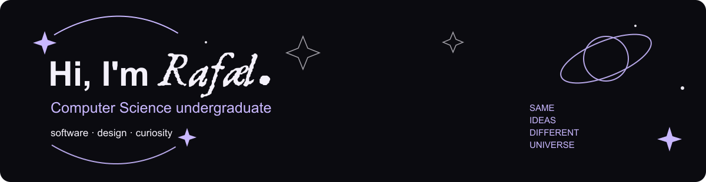

 

  

  

  

─────────────── ✦ ABOUT ME ✦ ───────────────

 

I'm a **Computer Science undergraduate** interested in the intersection between **software, design and technology**.

I like understanding how things work, solving problems and turning ideas into things that actually exist.

Currently building my foundation in software while exploring **Python, Java, Web Development, AI and UI/UX.**

  

  

─────────────── ◌ ECO-RADAR ◌ ───────────────

  

environmental monitoring · university project

  

 

### ABOUT THE PROJECT

**Eco-Radar** is an environmental monitoring platform developed as a first university project.

The project connects **Arduino hardware** with a web interface to collect and visualize environmental information.

 

<table>
<tr>

<td width="52%" valign="top">

### ◇ THE IDEA

Monitor environmental conditions through hardware sensors and make the collected information easier to visualize and understand.

 

The goal is simple:

**turn physical measurements into something people can actually see.**

</td>

<td width="48%" valign="top">

### ◇ THE STACK

 

**HARDWARE**

`Arduino`

 

**SOFTWARE**

`Python`
`HTML` · `CSS` · `JavaScript`

</td>

</tr>
</table>

  

  

### *turning data into something you can see.*

 

  

─────────────── ✦ NOW ✦ ───────────────

  

  

<table>
<tr>

<td width="33%" align="center">

`LEARNING`

  

Python · AI

</td>

<td width="33%" align="center">

`BUILDING`

  

Eco-Radar

</td>

<td width="33%" align="center">

`EXPLORING`

  

UI/UX · Web

</td>

</tr>
</table>

  

  

### *same ideas, different universe.*

 

✦

